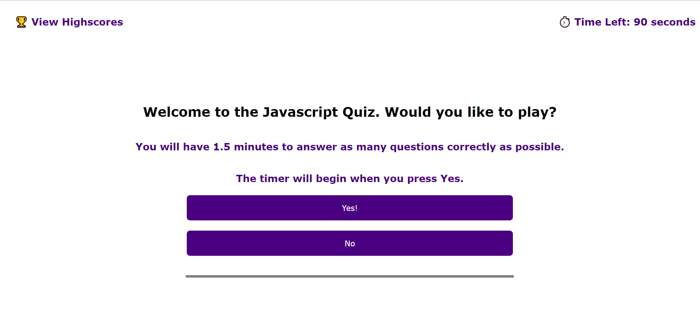

# Homework Assignment 3 - Code Quiz

## Your Task:
This week’s homework required us to build a timed coding quiz with multiple-choice questions. This quiz runs in the browser and will feature dynamically updated HTML and CSS powered by JavaScript code. It has a clean, polished, and responsive user interface.

## Built With:
* HTML
* CSS
* Javascript

Link to deployed application: https://egraham96.github.io/homework-assignment-04/                                                                                              
Link to GitHub Repository: https://github.com/egraham96/homework-assignment-04
